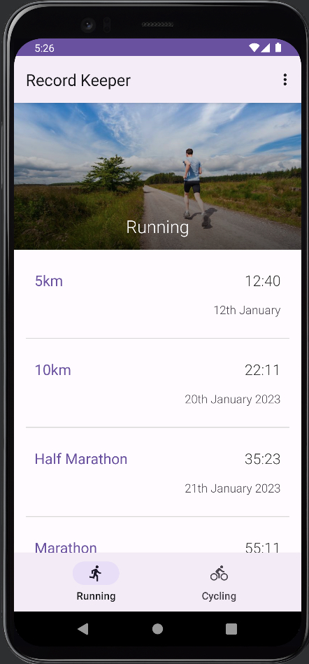
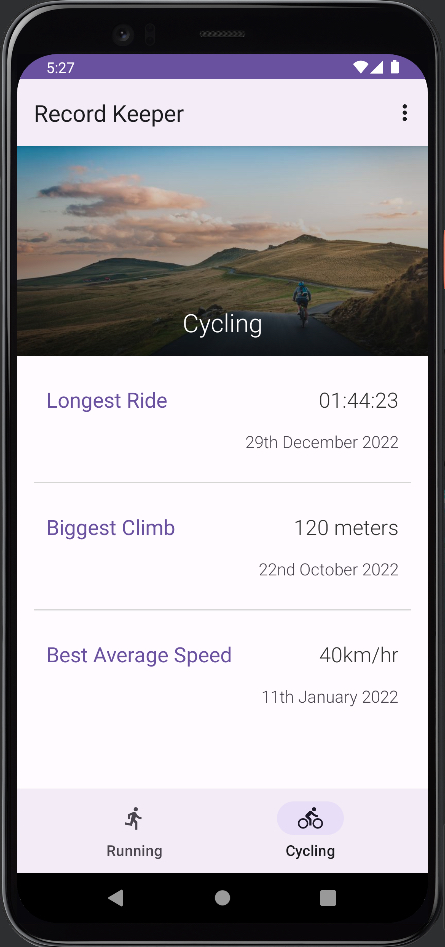
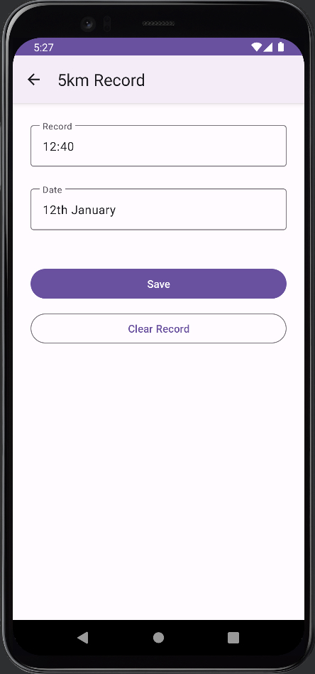

# Android Sports Record Keeper App

**Table of Contents**
- [Introduction](#introduction)
- [Motivation](#motivation)
- [Technology Used](#technologyUsed)
- [Build Status](#buildStatus)
- [Features](#features)
- [Installation](#installation)
- [Execution](#execution)

## Introduction 
An Android app to log Running and Cycling times. 

## Motivation 
This is a personal learning project aimed to teach me the tools and technology needed to build a native Android application. As later I would like to deploy an Android application to the Google Play store.

## Technology Used 
<table>
  <tbody>
    <tr>
      <td>Language</td>
      <td>Kotlin</td>
    </tr>
    <tr>
      <td>Frameworks</td>
      <td>Android Native Components</td>
      <td>Material Design</td>
    </tr>
  </tbody>
</table>

## Build Status 
Project is completed.

## Features 
- Bottom navigation bar
- Fragmented activity views of Running and Cycling records
- Scrollable list of records
- Editable records that are saved in the phone's memory

### Navigation bar

* User can switch between activity views by selecting either one of the icons on the bottom navigation bar

### Featured window - Categories

* User can see Landmarks grouped together by their category
* Landmarks are automatically grouped together depending on their underlying json data category field

### Featured window - Horizontal scrollable cards

* User can scroll horizontally through each category to view the different landmarks
* User can also click on each image to take them to a detail view of each landmark

### List window - Favourite Filter

* User can filter the list of landmarks by showing only their favourites by toggling the favourite button

### Detail window - Landmark information

* User can view detailed information about a particular landmark they selected in the featured or list activity window
* Information includes title, text location, geographical map, and description

### Detail window - favourite 

* User can toggle on/off if a landmark should be favourited or not

Detail window - Maps

* User can interact with the map on the detail activity window to view the surrounding area

# Installation 
* Ensure XCode is installed (only available on MacOS)

# Execution 
* Open the Landmarks.xcodeproj file in XCode
* Once the project is open you can click the play button at the top of the IDE to run the iPhone simulator
