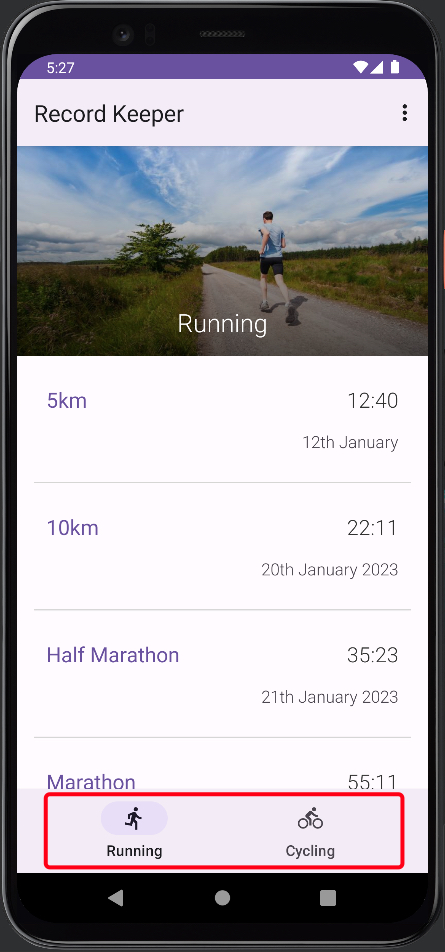

# Android Sports Record Keeper App

**Table of Contents**
- [Introduction](#introduction)
- [Motivation](#motivation)
- [Technology Used](#technologyUsed)
- [Build Status](#buildStatus)
- [Features](#features)
- [Installation](#installation)
- [Execution](#execution)

## Introduction 
An Android app to log Running and Cycling times. 

## Motivation 
This is a personal learning project aimed to teach me the tools and technology needed to build a native Android application. As later I would like to deploy an Android application to the Google Play store.

## Technology Used 
<table>
  <tbody>
    <tr>
      <td>Language</td>
      <td>Kotlin</td>
    </tr>
    <tr>
      <td>Frameworks</td>
      <td>Android Native Components</td>
      <td>Material Design</td>
    </tr>
  </tbody>
</table>

## Build Status 
Project is completed.

## Features 
- Navigation bar
- Fragmented activity views of Running and Cycling records
- Scrollable list of records
- Editable records that are saved in the phone's memory

### Navigation bar

* User can switch between activity views by selecting either one of the icons on the bottom navigation bar

### Fragmented activity views of Running and Cycling records

* User can view Running and Cycling information in its own fragmented activity view

### Scrollable list of records

* User can scroll vertically among all the different records (this will help with users with small screens)

### Editable records that are saved in phone's memory

* User can edit any record by clicking on it, updating the form, and clicking 'save'
* All records are saved to the phone's storage so when the user re-enter the app their previously saved records will still be there

# Installation 
* Ensure Android Studio is installed
* Connect a real android device to the PC (enable debug mode) or set up a mobile emulator

# Execution 
* Open the project file in Android Studio
* Once the project is open you can click the play button at the top of the IDE to run the Android application
